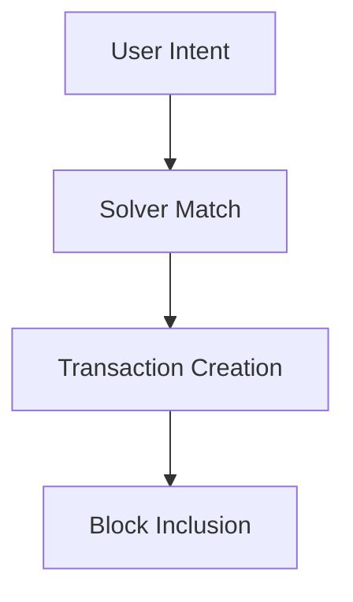

Anoma Protocol – Technologies Overview

Anoma is a next-generation, privacy-preserving blockchain protocol designed around *intent-centric architecture* and advanced cryptographic frameworks.

---

✨ Core Technologies

🔐 1. Zero-Knowledge Proofs (ZKP)
Anoma leverages advanced zk-SNARKs to ensure full transaction privacy while maintaining validity.  
- *Purpose:* Validity without revealing data  
- *Tool:* [arkworks](https://github.com/arkworks-rs)

---

🧠 2. Intent-Centric Architecture
Users express *what* they want (intents), not *how*.  
Solvers find valid counter-intents and match them.

---

🧩 3. MASP – Multi-Asset Shielded Pool
A unified, privacy-preserving asset pool supporting:
- Any asset
- Private transfers
- Swaps, barters

> Based on Zcash-style shielded transfers, extended to multi-asset/multi-party environments.

---

⚖️ 4. Taiga – zkRollup for Private Bartering
Taiga enables scalable, zero-knowledge execution of:
- Atomic swaps
- Multi-party barters
- Shielded liquidity

---

🧩 5. Ferveo – Decentralized, Private Block Scheduling
A privacy-focused leader election protocol that hides:
- Who proposes a block
- When it's scheduled

Protects against censorship and front-running.

---

🔄 6. Intent Gossip & Solver Network
Decentralized p2p network for:
- Broadcasting user intents
- Solver matchmaking
- Building atomic multi-party transactions

---

🧮 7. Homomorphic Encryption (Future)
Exploration for private computation without decryption.

---